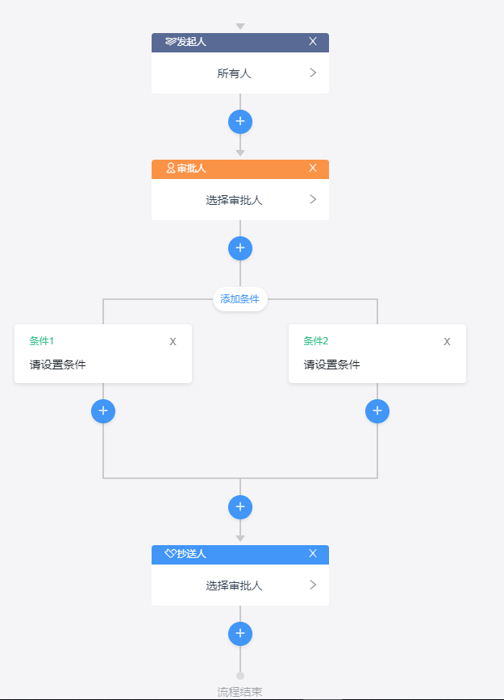

# workflow-ui 前端工作流 UI

基于vue前端工作流UI

## 前端工作流生成器-Generator



1、首先通过npm安装： npm install workflow-ui --save

（注意：新版本插件未生效的话，试试npm update命令，或者workflow-ui版本并删除node_modules重新下载）

2、全局定义组件(否则会报循环引用)：

main.js中

```
import Node from 'workflow-ui/src/components/Generator/node'
Vue.component('Node', Node)
```

3、在使用的地方：

```
<template>
  <div>
    <workflow
      :data="data"
      @ok="ok"
    />
  </div>
</template>
<script>
import workflow from 'workflow-ui/src/components/Generator'
import 'workflow-ui/lib/workflow-ui.css'
export default {
  components: {
    workflow
  },
  data () {
    return {
      data: {
        title: '请假',
        node: {
          name: '发起人',
          type: 'start',
          nodeId: 'sid-startevent',
          childNode: {}
        }
      }
    }
  },
  methods: {
    ok (data) {
      console.log(data)
    }
  }
}
</script>
```

## 源码 

https://github.com/go-workflow/workflow-ui


### 测试

首先，打开vue.config.js,修改entry为main.js,否则页面将会是空白：

```
entry: 'src/main.js'
```

npm i

npm run serve

### 重新build

npm run build

### 重新发布

1. package.json 更新版本号

2. 打开 vue.config.js

```
entry: 'src/index.js',
```

3. 发布到npm

npm publish


### 作者

邮箱：181457121@qq.com


